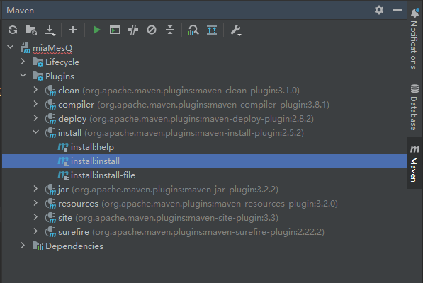

# 简介
##### 在单一 springboot 中，使用MQ中间件太过繁重，该’小功能‘可使一个接口的所有请求按顺序执行，并含有重试机制，类似于 MessageQueue  
# 使用
## 使用方法demo
* [https://github.com/rockyxiang1807/useMiaMesQ](https://github.com/rockyxiang1807/useMiaMesQ)
* 也可以直接将代码 copy 到代码中，稍作修改使用

## 使用详解
### clone 该项目代码到本地
``sh
git clone https://github.com/rockyxiang1807/miaMesQ
``
### 使用 maven 插件 install 到本地 maven 仓库

### 在项目中引入依赖
```xml
        <dependency>
            <groupId>com.miaMesQ</groupId>
            <artifactId>miaMesQ</artifactId>
            <version>0.0.1-SNAPSHOT</version>
        </dependency>
```
### 在启动类添加注解
```java
@EnableAsync
@ComponentScan({"com.miaMesQ","填写自己启动类所在的包名或者填写想要扫描的包名，否则将不会扫描到自己所写的bean"})
```
### 在启动类中添加
```java
    @Resource
    private MesQConsumer mesQConsumer;

    @Bean
    public MesQEntrance createFirst(){
        mesQConsumer.setClazz(MesQService.class); // 自己编写的实现类
        mesQConsumer.setRetry(3); // retry 最大次数
        return new MesQEntrance(mesQConsumer);
    }
```
### 启动类
```java
@EnableAsync
@ComponentScan({"com.miaMesQ","填写自己启动类所在的包名或者填写想要扫描的包名，否则将不会扫描到自己所写的bean"})
@SpringBootApplication
public class UseMiaMesQApplication {

    @Resource
    private MesQConsumer mesQConsumer;

    public static void main(String[] args) {
        SpringApplication.run(UseMiaMesQApplication.class, args);
    }

    @Bean
    public MesQEntrance createFirst(){
        mesQConsumer.setClazz(MesQService.class); // 自己编写的实现类
        mesQConsumer.setRetry(3); // retry 最大次数
        return new MesQEntrance(mesQConsumer);
    }
}
```
### 编写Controller
```java
@RestController
@RequestMapping("/api")
public class MesQController {

    @Autowired
    private MesQEntrance mesQEntrance;

    @GetMapping
    public void a(@RequestParam("s") String s)throws Exception{ // 自行定义错误处理
        Mes mes = new Mes(s); // 消息实体类, s 可以是任意类型
        mesQEntrance.pushMes(mes);   // 发送消息
        System.out.println("ok");
    }
}
```
### 编写Service
```java
public class MesQService {
    // 正常执行的方法 命名须为 normalProcess
    // 传参只有一个，如有多个参数建议将其封装到一个类中
    public static void normalProcess(Object  s)throws Exception{
        Thread.sleep(10000L);
        System.out.println("normalProcess "+s);
    }
    // 达到 retry 最大次数后执行的方法 命名须为 exceptionalProcess
    // 传参同  normalProcess
    public static void exceptionalProcess(Object s){
        System.out.println("exceptionalProcess "+s);
    }
}
```


